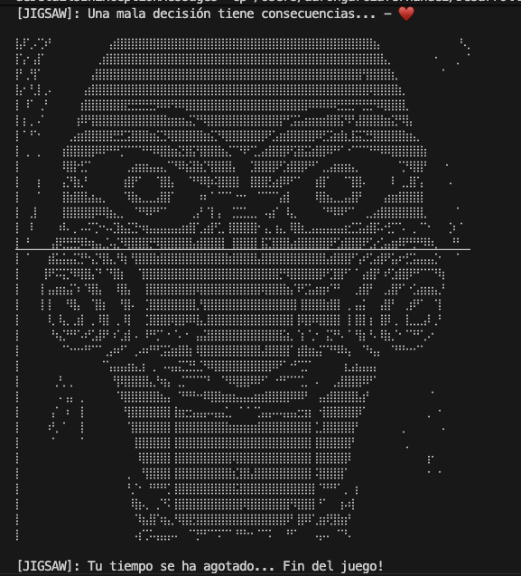

# 🧩 Jigsaw's Game: La Decisión es Tuya

Bienvenido a **Jigsaw's Game**, una experiencia de supervivencia en consola desarrollada en Java. No es solo un juego de "Piedra, Papel o Tijera"; es una prueba de nervios donde cada decisión puede ser la última.

---

## 🖼️ Arte Visual del Proyecto

Aquí puedes ver el arte que da vida al juego (utilizando caracteres Braille y ASCII):

### El Anfitrión

*Arte ASCII detallado que representa la interfaz del juego.*

### 🎥 Demostración en Vivo
¿Quieres ver el juego en acción? Echa un vistazo a la demo:

[](assets/demo.mp4)
*(Haz clic en la imagen superior para reproducir el vídeo de la demo)*

---

## 🕹️ Cómo Jugar

El objetivo es sencillo: conseguir **3 llaves 🔑** antes de perder tus **3 vidas ♥️**.

1. **Nombre**: Introduce tu identidad para que Jigsaw sepa a quién se enfrenta.
2. **Decisiones**: 
   - Usa `o` para **Piedra**.
   - Usa `-` para **Papel**.
   - Usa `x` para **Tijera**.
3. **Consecuencias**: 
   - Si ganas la ronda: +1 🔑
   - Si pierdes la ronda: -1 ♥️
   - Si empatas: Nadie gana nada.

---

## 🚀 Instalación y Ejecución

### Requisitos previos
* **Java JDK 11** o superior instalado.
* Terminal compatible con **UTF-8** (para visualizar correctamente los corazones y el arte ASCII).

### Ejecución
1. Clona el repositorio o descarga los archivos.
2. Asegúrate de tener las clases `App.java`, `AsciiArt.java` y `Typing.java` en el mismo paquete/directorio.
3. Compila y ejecuta:
   ```bash
   javac App.java
   java App